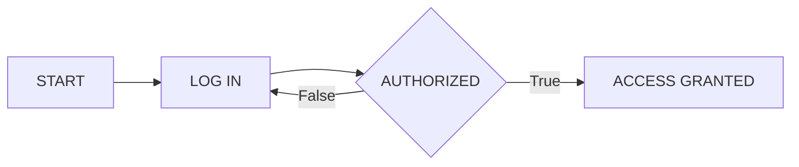
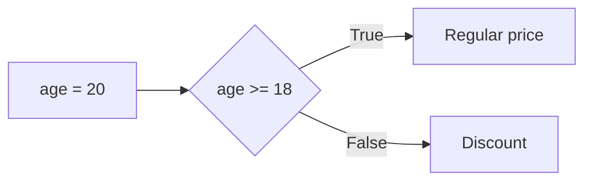

// mermaid VS Code plugin

# Python Documentation

**bold**

*italic*

***boold italic***


## Python

Python a une syntax simple, facile à lire.  
&nbsp; Il est largement utilisé pour développer des logiciels, des jeux, analyser  
des données et programmer des intelligences artificiels.

Les humains utilisent du code pour donner des instructions aux machines.

La fonction `print` permet d'afficher des messages à la console.  
```py 
print("Welcome")
print(500)
```  
  
  
## Memory & Variables

Computer programs use variables to remember important information,  
like item in  a shopping cart, prices and discounts.

The line of code below tells the computer to store 
information in a variable  
called item.  

```py
item = "bike"
```
To create a variable, you just need to give it a name.  
&nbsp; The information that you need to store is added on the right.  
Variables have a **name** and a **value**.  
&nbsp; They are connected with the **equal sign =**.  
You can think of a varibale as a box that contains some information.  

## Text Data

A large amount of information out there consists of text.  
&nbsp; A piece of text data is called a string.  
**Strings** in Python need to be surrounded by **quotation marks**.  

```py
"TheLordoftheRings"
```

We use quotation marks to tell Python that we are working with  
a piece of text data.  
&nbsp; Strings can be stored in variables.  
In Python, both single ' and double " quotes can be used to define strings.  
&nbsp; The quotation marks just need to match. 

The code in computer programs is made of **statements**.  
&nbsp; Statements are the instructions for the computer to follow.  
The **print()** statement is the easiest way to send a value to the screen.

## Numerical Data

Numerical data is information that comes in the form of numbers.  
&nbsp; Numerical values can be directly stored in variables.  
Numerical data souldn't be in quotation marks.  
&nbsp; The line of code below declares a numerical variable.  
```py
points = 500
```

You can perform math operations with numbers.  

```py
print(7 + 3)
print(15 - 5)
print(5 * 2)
print(20 / 2)
```

## Working with Variables

A variable's name is used to identify where that information is stored.  
&nbsp; You can access the value that a variable is storing by calling its name. 

```py
budget = 200
print(budget)
$ 200
```

You can make calcultions using the values in varibales.  

```py
budget = 20
print(budget + 10)
$ 30

price = 5
amount = 3
print(price * amount)
$ 15
```

You can store the result of a calculation in a variable.  

```py
score = 7 + 8
print(score)
$ 15
```

You can create a new variable to store the result of a calculation made  
using other variables.  

```py
price = 5
amount = 6
total = price * amount
$ 30
```

You can update the value stored in a variable. The variable will forget  
the previously stored value.  
&nbsp; Its called reassigning a variable.
You can use variable to construct a new  
variable.  

```py
price = 99
price = 100
print(price)
$ 100

level = 14
level = level + 1
print(level)
$ 15

salary = 1000
pay_raise = 100
new_salary = salary + pay_raise
print(new_salary)
$ 1100
```

## Debugging

Coding consist of 3 steps :

- Writing 
- Executing (or running )
- Fixing errors (or debugging)

Machine will refuse to follow instructions from a human if  they contain  
mistakes.  
&nbsp; If you making mistakes, it's ok! You're on the right track.  
Event the tiniest typo or a misplaced tab in your code will result in an error.  

Bugs are an expected part of writing code.  
&nbsp; The trick to being a good coder is staying cool when dealing with bugs.  
If your code contains multiple bugs, you need to fix all of them for the code  
to be executed correctly. 

The computer reads and executes instructions line by line,  
from top to bottom.  
&nbsp; The execution will be interrupted at the first error encountered.  

## Best Practices

You can add comments to your code with the hash symbol # .  
&nbsp; Python is a case sensitive language.  
Snake case is the best practice when creating multi-word variable names.  
&nbsp; Python will return an error if your variables names contain spaces.   
It means to use **underscore _** instead of spaces between words.  
&nbsp; A variable name can contain a number but cannot start with a number.

```py
# use snake case
user_id
```

## Inputs and Outputs

Computer programs are designed to interact with users and the outside  
world.  

An **input** is any information that goes into a computer.  
&nbsp; The press of a key and the click of a button are examples of **inputs**.  
The **input()** instruction is the easiest way to allow a user to insert a value  
into a program.

```py
# ask the user for a value that gets stored in a variable.
user_entry = input()
```

An **output** is a way for the computer to communicate with the outside  
world.  
&nbsp; A message displayed on the screen and the sound from a speaker are  
examples of **outputs**.  
The **print()** instruction is the easiest way to  get your computer program to  
generate an output.   

## Data Types

Data comes in different shapes and forms.  
&nbsp; Computers treat different types of data in different ways.  

**String** is the **data type** for a piece of text.  
&nbsp; The quotation marks tell the computer that a value needs to be stored as  
a string.  
&nbsp; Anything in quotation marks will be treated as a string, even numbers.  

```py
# This are strings
"bike"
"360"
"2.0"
"-5"
```
**Integers** are a whole numbers without a decimal point.  
&nbsp; They can be positive, negative or zero.  

```py
# This are integers
20
 0
-3
```

**Float** is the data typoe form numbers with decimal places, they can be  
positive or negative.

```py
# This are floats
3.14
-4
```

The division of two integers always produces a float.  

```py
variable = 5/2
```

When you use the + addition operator with string values the two strings are  
joined together.  
&nbsp; This is known as **concatenation**.  

```py
a = "basket"
b = "ball"
print(a+b)
$ basketball
```

You won't be able to do math operations if numbers are surounded by  
quotes.  
&nbsp; They will be treated as strings.  

```py
print("360" + "360")
$ 360360
```

### Data Type Checking

We use data types to tell acomputer how to store and behave with a value.  
&nbsp; Dealing with data in the incorrect format can result in data loss or corruption.  

```py
# You can't add a number to a string
a = 3
b = "8"
print(a + b)
$ error
```

Data can come to you in the incorrect format.  
&nbsp; You can use the **type()** instruction to check the data type stored in a  
variable.  

```py
balance = "780"
print(type(balance))
$ string
```

### Data Conversion

Data can come in the incorect format.  
&nbsp; Data from survey and web forms can come to you with quality issues.  

The **input()** instruction always turns the user input into a string,  
no matter what the user enters.  

```py
birth_year = input()
print(type(birth_year))
$ string
```

Numerical values should not be stored as strings because you won't be able  
to do math with the values.

You can convert data from one type to another to fix data quality issues.  

The **int()** instruction converts any type of value into an integer.  

```py
height = int(input())
print(type(height))
$ int
```

The **float()** instruction converts values into floats.

```py
a = 15
b = float(a)
print(b)
$ 15.0
```

The **str()** instruction converts values into strings.

```py
a = 15
b = str(a)
print(type(b))
$ string
```

### Fixing Data Types

You can use explicit data type conversions to avoid bugs in your programs.  

The **int()**, **str()**, **float()** instructions are examples of **explicit** conversion  
because they are given by a programmer.  

```py
# This is an implicit conversion.
# We will have a concatenation of strings.
x = input()
y = input()
print (x + y)
```

int() ensures that the user input is treated as an integer number.  
&nbsp; str() can help you cancatenate numbers with text.  


Math operations between integers and floats produce a float.  

```py
x = 9
y = 3.0
print (x + y)
$ 12.0
```

## Comparison Operations  

**Comparison operations** are key to the development of computer programs.  
&nbsp; A comparison operation always results in either one of these two outcomes:  
Yes (True) or No (False).

```py
print (30 < 25)
$ False
```
The **Boolean** is a data type that only has two possible values: True or False.  
&nbsp; Both **"True"** and **"False"** start with an uppercase letter.  

You can store boolean values in variables.

```py
sleep = True
```

You can store the result of a comparison operation in a variable.

```py
heart_rate = 165
peak_rate = heart_rate > 160
```

## Logical Operations

**Logical operations** are needed for machines to evaluate complex scenarios.  
&nbsp; Logical operations use Boolean values inputs to produce a single Boolean  
output.
  

The **"and" operation** result in a True value only when all the inputs are  
True at the same time :
* True and True = True  
* Every other combination = False

The **"or" operation** result in a True value if at least one of the inputs is True :   
* False or False  = False  
* Every other combination = True

Both **"and"** and **"or"** operators are lowercase.  

You can store the result of a logical operation in a variable.  

```py
a = True and False
print(a)
$ False
```

## Combining Comparison and Logical Operations

 ```py
light_on = True
door_locked = False
print(light_on or door_locked)
$ True
```

You can put parentheses around the operations that should be done first.  
&nbsp; It makes the code easier to read.  

 ```py
a = (3 > 2) or False
print(a)
$ True
```

## Control Flow

**Sequencing** is when computers run your code in order, from top to bottom.  

**Iteration** is about executing an instruction repeatedly and commonly represented as a loop.  

**Selection** specifies when to follow each path.  

An **Algorithm** is a set of step-by-step instructions to complete a task,  
placed in a certain order.  

**Natural language** is a good start to represent an algorithm.  

```
"Enter login details.
Check if login is authorised.
If so, grant access.
If not, keep requesting user to log in until authorised"
```

**Pseudocode** is a way to represent an algorithm.  
&nbsp; It's a simplified language that is a bit closer to programming language.  

```
start
repeat until authorised = true
    INPUT log_in
access_granted = true
```

**Flowcharts** help to visualize algorithms.  



### For Loops

A **for loop** is used to execute the same instruction over and over again,  
a specific number of times. The variable **i** keeps track of the number of  
iterations.  

```py
for i in range(5) :
    print("hello") 
# Hello will be printed 5 times
```

**range()** generates a series of integers numbers.  
&nbsp; **range(5)** creates 5 numbers in a sequence, starting from 0 : 0, 1, 2, 3, 4, 5.  

The code that get repeated in for the loop must be intended.  
&nbsp; **Indentation** is the spaces at the begining of lines.  
Code that is not correctly indented will result in errors.  

The initial loop statement must be followed by a **colon : symbol**.  
&nbsp; This signals the start of the iteration block.  

### While loops

**While loops** are used when you don't know how many iterations  
will be needed.  **While loops** repeat code whilst a condition holds true.  

For example, a ticket seller at a theater will repeatedly sell tickets until  
all seats have been occupied.

```py
seats = 300
while seats > 0 :
    print("Sell ticket")
    seats = seats - 1
```

The while keyword is followed by the condition under wich the code is repeated.  
&nbsp; When the condition no longer holds true, we exit the while loop.  

Loops usually include **counters**.  
&nbsp; A counter is a variable that keeps track of the number of iterations.  
Counter variables are updated inside the loop, so they change with every  
iteration. An initial value is set outside the loop, as the starting point.  

Whith while loops you can run into what is known as an infinite loop.  
&nbsp; This is when the condition holds true forever, and the code never stops  
repeating. Counter help you avoid infinite loops.  

```py
counter = 0
while counter < 4 :
    print(counter)
    counter = counter + 1
```

| iteration # | counter | condition  counter < 4 | output print(counter) | update counter counter = counter +1 |  
| :---- | :----: | :----: | :----: | ----: |  
| 1 | 0 | True | 0 | 1 = 0 + 1 |  
| 2 | 1 | True | 1 | 2 = 1 + 1 |  
| 3 | 2 | True | 2 | 3 = 2 + 1 |  
| 4 | 3 | True | 3 | 4 = 3 + 1 |  
| 5 (end) | 4 | False | END OF LOOP | END OF LOOP |  


Use **for** loops when you already know the number of iterations,  
and **while** loops when there is a condition that needs to be met.  

## Conditional Statements

Conditional statements, or **if-else statements**, allow programs to perform  
different actions based on the conditions.  

The code decides if a discounbt should be applied based on age.



```py
age = 16
if age >= 18 :
    print("Regular price")
else : 
    print("Discount")
```

The **if conditional"** statements starts with the keyword **if** followed by  
the condition and a **colon : symbol**.

The else conditional statement starts with the keyword **else** followed by  
a **colon : symbol**.

You can use the **elif** statement (short for "else if") to check for more conditions   
if the first condition is not met.

```py

if age < 18:
    print("Junior discount")
elif age >= 75: 
    print("Senior Discount")
else:
    print("No discount")
```

## Lists

What do a shoppinglist, a playlist, a box of chocolates, and a bookshelf   
have in common ?  
&nbsp; They are a collection of items.  

**Lists** allow you yo store a collection of multiple values in a single variable.  
&nbsp; Add **square brackets []** around the values to create a list.  
```py
cart = [ "milk", "tea", "jam"]
``` 
A list can store multiple values.  
&nbsp; The differents items in a list need to be separated by **commas**.  
Just like variables, lists have a name.  
&nbsp; Lists can store any data type.  

You can access an item in alist using its position or **index number**.  
&nbsp; The first item in a list has an **index number of 0.**  

## Indexing

You can refer to values in a list using their position (or index).  
&nbsp; Include the index in square brackets to refer to the item

```py
animals = ["cat", "dog", "bird"]
# refer to dog
animals[1]
print(animals[1])
$ dog
```
Lists are **mutable**.  
&nbsp; This means you can change their values even after they've  been created.  

```py
products = ["apples", "oranges", "bananas"]
products[2] = "lime"
print(products[2])
$ lime
```

```py
words = ["rise", "sun", "glasses"]
print(words[1] + words[0])
$ sunrise

nums = [1, 5, 4, 8]
print(nums[0] + nums[2])
$ 5
```
A string is a sequence of characters.  
&nbsp; The characters in a string can include spaces and punctuation marks.
```py
animal = "Dog"
print(animal[0])
$ D

notification = "New message!"
print(notification[4])
$ m
```
Strings are **immutable**, which means that you can't change the characters in  
a string. If you try  you'll get an error.

## Slicing

**Slicing** allows you to extract a portion of a list.
Starting and stopping indexes  
are separated by a **colon :** .

The starting index is inclusive. The stopping index is exclusive.  

|        |"cat"  | "dog" | "bird" | "cow" |      |
| :---   | :---: | :---: | :---:  | :---: | ---: |
|        |   0   |   1   |    2   |  3    |   4  |
| [1:3]  |       |   x   |    x   |       |      | 
| [0:2]  |   x   |   x   |        |       |      |   
| [0:4]  |   x   |   x   |    x   |   x   |      | 

Slicing a list produce another list.  

```py
animals = ['dog', 'cat', 'bird', 'cow']
print(animals[1:4])
$ ['cat', 'bird', 'cow']
print(animals[1:3])
$ ['cat', 'bird']
```

Slicing also works with strings.  
&nbsp; Slicing a string produce another string
```py
vehicle="airplane"
print(vehicle[0:3])
$ air
```
When slicing, you can omit the stopping index.  
&nbsp; This means that you'll be slicing until the very last element.

```py
animals = ['dog', 'cat', 'bird', 'cow']
print(animals[1:])
$ ['cat', 'bird', 'cow']

print(animals[:2])
$ ['dog', 'cat']

vehicle = 'motorbike'
print(vehicle[5:])
$ bike
```

Python supports "indexing from the end", called **negative indexing**.  
&nbsp; This means the last value of a sequence has an index of -1.  

| "cat" | "dog" | "bird" | "cow" |  
| :---- | :---: | :----: | ----: |
|  -4   |  -3   |   -2   |  -1   |  

```py
c = ['$', '€', 'Y', '£']
print(c[-1])
$ £

vehicle = 'motorbike'
print(vehicle[-1])
$ e

# Output the two last values
c = ['$', '€', 'Y', '£']
print(c[-2:])
$ ['Y', '£']

# Output the two values in the middle
c = ['$', '€', 'Y', '£']
print(c[-3:-1])
$ ['€', 'Y']

# Print bike
vehicle = 'motorbike'
print(vehicle[-4:])
$ bike
```

You can combine positive with negative indexing with slicing.  

```py
c = ['$', '€', 'Y', '£']
print(c[1:-1])
$ ['€', 'Y']
```

You can replace

```py
c = ['$', '€', 'Y', '£']
c[:2] = ['F', 'B']
print(c)
$ ['F', 'B', 'Y', '£']
```

## Iterating over Lists

You can automate and speed up the processing of a large amount of data  
if you know how to **iterate over a list**.  

You can check if an item is in a particular list by using the in operator.  
&nbsp; It returns **True** if the item occurs one or more times in the list,  
and **False** if it doesn't.  

```py
products = ['milk', 'eggs', 'apples']
print('bananas' in products)
print('milk' in products)
$ False
$ True
```

The **in** operator also works with strings.  

```py
word = "movie"
print('o' in word)
$ True
```

You can use the **for** loop with the **in** operator to iterate over lists and perform  
the same operation for each element.  

```py
products = ['milk', 'eggs', 'apples']
for i in products:
    print(i)
$ milk
$ eggs
$ apples
```
The iterator variable **i** stands for each item in the lists.   
&nbsp; As The list goes on, it changes to the next item.  

You can perform any operation with the items in the list during each iteration.  

```py
new_users = ['Tom', 'Mery', 'Anna']
for i in new_users:
    print("welcome, " + i)
$ Welcome, Tom
$ Welcome, Mery
$ Welcome, Anna
```

You can use any name instead of the i for the iteration variable.  
&nbsp; You can do math with numerical items in a list during the iteration.  

```py
# increase all prices by 5
prices = [15, 9, 5]
for price in prices:
    price = price + 5
```

Python has many techniques to enhance code readability and simplicity.  
&nbsp; The shorthand operator **+=** provides an easy way to increment a variable's  
value :  x += 5 is a shorthand for x = x + 5  
&nbsp; Shorthand operators are especially usefull in iterations.  

```py
prices = [15, 9, 5]
for price in prices:
    price += 5
```

## Nested Loops

Nested loops, a concept where one loop operates within another,  
are crucial in programming.  
&nbsp; Widely used in various real-world applications, from game development  
to data analysis, nested loops are key to advancing your coding skills.  

```py
vehicles = ['car', 'bike']
colors = ['red', 'blue']
for vehicle in vehicles:
    for color in colors:
        print(vehicle + ' ' + color)
```

You can create nested loops with **ranges** as well.  

```py
for i in range(1,3):
    for j in range(2,4):
        print(i, j)
$ 1, 2
$ 1, 3
$ 2, 2
$ 2, 3
```

Each iteration of the outer loop runs the inner loop entirely.

## Iterations and Selections

Using loops and conditions can help with many tasks.  

```py
scores = [45, 67, 89, 34, 77]
for score in scores :
    if score >= 70 :
        print("Passed")
    else :
        print("Failed")
```

You can use the for loop to iterate over strings, which is handy for examining  
text data like looking for certain words or symbols.  

```py
# Calculate the number of 'a' characters in the text
message = "You have a new message"
count = 0
for i in message :
    if i == "a" :
        count += 1
print(count)
```

```py
# Display animals that have a 'r' in their names
animals = ['cat', 'turtle', 'tiger', 'dog', 'lion']
for i in animals:
    if 'r' in i:
        print(i)
```

```py
# Find the total sum of all values in the given list
prices = [150, 79, 35, 259]
total = 0
for i in prices:
    total += i
print total
```

## Break and Continue

The **break** statement is used to stop the loop when some condition is met.  
&nbsp; This is useful when searching for a specific item or condition, and there's no  
need to continueonce it's found.  

The break statement must be placed within the if statement where the  
condition is defined, ensuring proper indentation.  

```py
for i in songs:
    if song == "Hello":
        print("Song found")
    break
```

The break statement stops a loop when a condition is met.  
&nbsp; It's handy if you're unsure when a specific condition will be satisfied.  

```py
# The following code will keep asking the user to input 
# and display it until they enter 'Stop'
while True :
    text = input()
    print(text)
    if text = 'Stop':
        break
```

**while True** means the while loop's condition is always true, causing it to run  
indefinitely.  
&nbsp; It will only stop when the condition for the break statement is met.  

The **continue** statement allows you to skip the curent iteration of a loop when  
a certain condition is true.  

```py
# All grades will be displayed except those below 50
grades = [45, 80, 55, 90, 48, 30, 60]
for grade in grades:
    continue
print(grade)
```

```py
# It will display items that don't start with l
animals = ['cat', 'giraffe', 'lion', 'leopard', 'mouse']
for animal in animals:
    if animal[0] == "l":
        continue
    print(animal)
```

## Functions

Functions are reusable blocks of code for specific tasks.   
&nbsp; They help keep your code as short and easy to work with as possible,  
saving you from repeating code.

**print()**, **input()** and **type()** are functions.  

We pass informations into functions as **arguments**.  

```py
print("New message")
```
Arguments go inside parentheses () after the function name.  
 
The **range()** function takes in a number as an argument and generates a  
sequence of numbers.  
``range(3)`` will generate a sequence of 3 arguments : 0, 1, 2.  

Functions need their arguments to work. Missing arguments can results in  
errors.  

A function can take **multiple arguments** : 
``print("Your seat:", 4)``  
Arguments are separated with a **comma**.  

print() and range() are examples of **built-in functions**. Python has many built-in  
functions which you can re-use in your code by calling them.  

The **type()** function check the data type of an argument.  

A function can be an argument for another function : ``print(type("word"))``  

**int()**, **str()** and **float** instructions are functions used for data conversion.  

## String Functions

A string is a sequence of characters in quotes.  
&nbsp; **String functions** make it easier to work with text.  

The functions **upper()** and **lower()** allow you to quickly change the case  
of a string to all in uppercase or lowercase, respectively.  

```py
'SmArTpHoNe'.lower()
'SmArTpHoNe'.upper()
```

upper() and lower() functions can only be used on strings.  
&nbsp; Function that only work on certain **objects** (strings, lists, etc.) are called  
using **dot. notation**.

```py
brand = "ikea"
print(brand.upper())
```

The **capitalize()** fucntion will convert the first character of a string to  
uppercase, while making the remaining characters lowercase.  

```py
"hApPy BirThday".capitalize()
$ Happy birthday
```
Strings are immutable and functions won't change them.  
&nbsp; You'll need to store the modified string in a variable to keep it.  

```py
item = 'smartwatch'
item2 = item.upper()
```

The **find()** function check if a character (or a pattern of characters) is present  
in a string.  
&nbsp; The function return the index (position) of the given value.  
 If the given value is present multiple times, the function will return the first  
 occurence (the lowest index).  
 &nbsp; find() will return **-1** if the value can't be found in the string.  

|     | Bee |     |
| :-- | :-: | --: | 
| "B" | "e" | "e" |  
|  0  |  1  |  2  |

 ```py
 insect = "Bee".find("e")
 print(insect)
 $ 1
 ```

## List Functions  

Lists are ordered sequence of items.  

**len()** stands for **lenght** and returns the number of items in the list.  
&nbsp; It accepts any sequence, including strings.  

```py
movie = "Avatar"
print(len(movie))
$ 6
```
The **append()** function adds a new item to the end of a list.  
&nbsp; It is called using dot notation because it's specific to lists.  
It doesn't works on strings because strings are immutable. 

```py
songs = ['Yesterday', 'Hello', 'Believer']
songs.append("Imagine")
```

The **insert()** function allows you to add an element to a list,  
at a specific position.  
&nbsp; It takes to arguments : the first is the index (where to insert) an the second  
is the item (what to insert).   

```py
songs = ['Yesterday', 'Hello', 'Believer']
songs.insert(2, "Imagine")
```

The **pop()** function removes an element from a list.  
&nbsp; That position indicated by the **index** is the only argument that the pop()  
function accepts.  

```py
songs = ['Yesterday', 'Hello', 'Believer']
songs.pop(2)
```

## Custom Functions

A function is a reusable block of code.  
&nbsp; To use your own function, you need to **define** them first.  

Once a function has been defined, you can **call** it as many times as you need.  
&nbsp; Use **def** followed by a **name** to define a new function.  
The **body** of a function contains the reusable code that is executed when  
the function is called.  
&nbsp; The code for the body must be **indented**.  
You need to make sure **parentheses ()** are added after the name.  
&nbsp; A **colon :** must be added at the end of the definition line.  
Function must be defined before they can be called.  

```py
def greet():
    print("Hello from a function")
    print("Have a great day")

greet()
```
A function might require arguments to complete its tasks.  
&nbsp; Arguments are put inside the parentheses () following the function name.  

```py
def personale_greet(name):
    print("Hello, " name)
    print("Have a great day")

personal_greet("James")
```
You need to use the same number of arguments that have been defined,  
in the same order.  
&nbsp; The result of a function can be sent back with the **return** statement.  
This is particulary helpful when you need to continue using the result value  
in your program.  

```py
def bmi(weight, height):
    index = weight / (height * height)
    return index

p6 = bmi(78, 1.80)
print(p6 < 18.5)
```

Multiple return values need to be separated by commas.  
&nbsp; The execution of the code inside a function ends when a value is returned.  
Any additionnal lines of code after the return line will be ignored.  

```py
 def rect(lenght, width):
    area = lenght * width
    perimeter = 2 * lenght + 2 * width
    return area, perimeter
    # End of function execution
    area = d1 * d2
 ```

 Python allows function arguments to have **default values**.  
 &nbsp; If the function is called without the argument, the argument gets its default  
 value. The **equal=sign** make the argument optional.   

 ```py
 def greet(name="Guest"):
    print("Welcome ", name)

greet() # Welcome Guest
greet("John") # Welcome John
 ```
