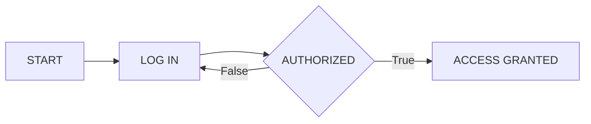
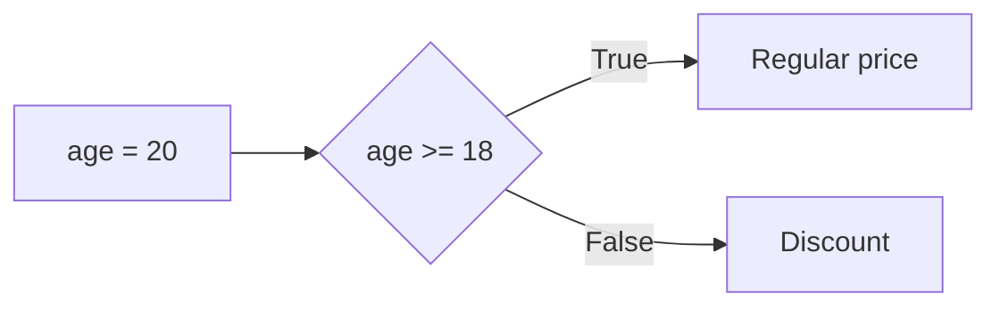
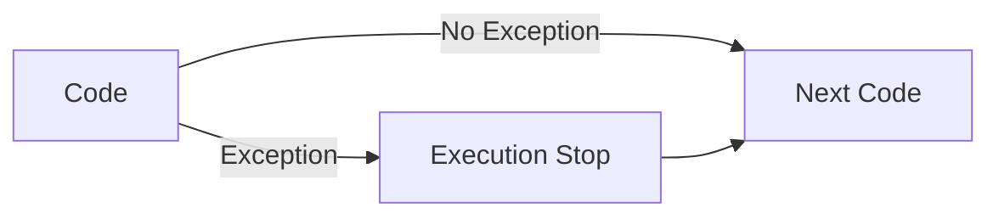

// mermaid VS Code plugin
// Preview Ctrl+K V
# Python Documentation

**bold**

*italic*

***boold italic***


## Python

Python a une syntax simple, facile à lire.  
&nbsp; Il est largement utilisé pour développer des logiciels, des jeux, analyser  
des données et programmer des intelligences artificiels.

Les humains utilisent du code pour donner des instructions aux machines.

La fonction `print` permet d'afficher des messages à la console.  
```py 
print("Welcome")
print(500)
```  
  
  
## Memory & Variables

Computer programs use variables to remember important information,  
like item in  a shopping cart, prices and discounts.

The line of code below tells the computer to store 
information in a variable  
called item.  

```py
item = "bike"
```
To create a variable, you just need to give it a name.  
&nbsp; The information that you need to store is added on the right.  
Variables have a **name** and a **value**.  
&nbsp; They are connected with the **equal sign =**.  
You can think of a varibale as a box that contains some information.  

## Text Data

A large amount of information out there consists of text.  
&nbsp; A piece of text data is called a string.  
**Strings** in Python need to be surrounded by **quotation marks**.  

```py
"TheLordoftheRings"
```

We use quotation marks to tell Python that we are working with  
a piece of text data.  
&nbsp; Strings can be stored in variables.  
In Python, both single ' and double " quotes can be used to define strings.  
&nbsp; The quotation marks just need to match. 

The code in computer programs is made of **statements**.  
&nbsp; Statements are the instructions for the computer to follow.  
The **print()** statement is the easiest way to send a value to the screen.

## Numerical Data

Numerical data is information that comes in the form of numbers.  
&nbsp; Numerical values can be directly stored in variables.  
Numerical data souldn't be in quotation marks.  
&nbsp; The line of code below declares a numerical variable.  
```py
points = 500
```

You can perform math operations with numbers.  

```py
print(7 + 3)
print(15 - 5)
print(5 * 2)
print(20 / 2)
```

## Working with Variables

A variable's name is used to identify where that information is stored.  
&nbsp; You can access the value that a variable is storing by calling its name. 

```py
budget = 200
print(budget)
$ 200
```

You can make calcultions using the values in varibales.  

```py
budget = 20
print(budget + 10)
$ 30

price = 5
amount = 3
print(price * amount)
$ 15
```

You can store the result of a calculation in a variable.  

```py
score = 7 + 8
print(score)
$ 15
```

You can create a new variable to store the result of a calculation made  
using other variables.  

```py
price = 5
amount = 6
total = price * amount
$ 30
```

You can update the value stored in a variable. The variable will forget  
the previously stored value.  
&nbsp; Its called reassigning a variable.
You can use variable to construct a new  
variable.  

```py
price = 99
price = 100
print(price)
$ 100

level = 14
level = level + 1
print(level)
$ 15

salary = 1000
pay_raise = 100
new_salary = salary + pay_raise
print(new_salary)
$ 1100
```

## Debugging

Coding consist of 3 steps :

- Writing 
- Executing (or running )
- Fixing errors (or debugging)

Machine will refuse to follow instructions from a human if  they contain  
mistakes.  
&nbsp; If you making mistakes, it's ok! You're on the right track.  
Event the tiniest typo or a misplaced tab in your code will result in an error.  

Bugs are an expected part of writing code.  
&nbsp; The trick to being a good coder is staying cool when dealing with bugs.  
If your code contains multiple bugs, you need to fix all of them for the code  
to be executed correctly. 

The computer reads and executes instructions line by line,  
from top to bottom.  
&nbsp; The execution will be interrupted at the first error encountered.  

## Best Practices

You can add comments to your code with the hash symbol # .  
&nbsp; Python is a case sensitive language.  
Snake case is the best practice when creating multi-word variable names.  
&nbsp; Python will return an error if your variables names contain spaces.   
It means to use **underscore _** instead of spaces between words.  
&nbsp; A variable name can contain a number but cannot start with a number.

```py
# use snake case
user_id
```

## Inputs and Outputs

Computer programs are designed to interact with users and the outside  
world.  

An **input** is any information that goes into a computer.  
&nbsp; The press of a key and the click of a button are examples of **inputs**.  
The **input()** instruction is the easiest way to allow a user to insert a value  
into a program.

```py
# ask the user for a value that gets stored in a variable.
user_entry = input()
```

An **output** is a way for the computer to communicate with the outside  
world.  
&nbsp; A message displayed on the screen and the sound from a speaker are  
examples of **outputs**.  
The **print()** instruction is the easiest way to  get your computer program to  
generate an output.   

## Data Types

Data comes in different shapes and forms.  
&nbsp; Computers treat different types of data in different ways.  

**String** is the **data type** for a piece of text.  
&nbsp; The quotation marks tell the computer that a value needs to be stored as  
a string.  
&nbsp; Anything in quotation marks will be treated as a string, even numbers.  

```py
# This are strings
"bike"
"360"
"2.0"
"-5"
```
**Integers** are a whole numbers without a decimal point.  
&nbsp; They can be positive, negative or zero.  

```py
# This are integers
20
 0
-3
```

**Float** is the data typoe form numbers with decimal places, they can be  
positive or negative.

```py
# This are floats
3.14
-4
```

The division of two integers always produces a float.  

```py
variable = 5/2
```

When you use the + addition operator with string values the two strings are  
joined together.  
&nbsp; This is known as **concatenation**.  

```py
a = "basket"
b = "ball"
print(a+b)
$ basketball
```

You won't be able to do math operations if numbers are surounded by  
quotes.  
&nbsp; They will be treated as strings.  

```py
print("360" + "360")
$ 360360
```

### Data Type Checking

We use data types to tell acomputer how to store and behave with a value.  
&nbsp; Dealing with data in the incorrect format can result in data loss or corruption.  

```py
# You can't add a number to a string
a = 3
b = "8"
print(a + b)
$ error
```

Data can come to you in the incorrect format.  
&nbsp; You can use the **type()** instruction to check the data type stored in a  
variable.  

```py
balance = "780"
print(type(balance))
$ string
```

### Data Conversion

Data can come in the incorect format.  
&nbsp; Data from survey and web forms can come to you with quality issues.  

The **input()** instruction always turns the user input into a string,  
no matter what the user enters.  

```py
birth_year = input()
print(type(birth_year))
$ string
```

Numerical values should not be stored as strings because you won't be able  
to do math with the values.

You can convert data from one type to another to fix data quality issues.  

The **int()** instruction converts any type of value into an integer.  

```py
height = int(input())
print(type(height))
$ int
```

The **float()** instruction converts values into floats.

```py
a = 15
b = float(a)
print(b)
$ 15.0
```

The **str()** instruction converts values into strings.

```py
a = 15
b = str(a)
print(type(b))
$ string
```

### Fixing Data Types

You can use explicit data type conversions to avoid bugs in your programs.  

The **int()**, **str()**, **float()** instructions are examples of **explicit** conversion  
because they are given by a programmer.  

```py
# This is an implicit conversion.
# We will have a concatenation of strings.
x = input()
y = input()
print (x + y)
```

int() ensures that the user input is treated as an integer number.  
&nbsp; str() can help you cancatenate numbers with text.  


Math operations between integers and floats produce a float.  

```py
x = 9
y = 3.0
print (x + y)
$ 12.0
```

## Comparison Operations  

**Comparison operations** are key to the development of computer programs.  
&nbsp; A comparison operation always results in either one of these two outcomes:  
Yes (True) or No (False).

```py
print (30 < 25)
$ False
```
The **Boolean** is a data type that only has two possible values: True or False.  
&nbsp; Both **"True"** and **"False"** start with an uppercase letter.  

You can store boolean values in variables.

```py
sleep = True
```

You can store the result of a comparison operation in a variable.

```py
heart_rate = 165
peak_rate = heart_rate > 160
```

## Logical Operations

**Logical operations** are needed for machines to evaluate complex scenarios.  
&nbsp; Logical operations use Boolean values inputs to produce a single Boolean  
output.
  

The **"and" operation** result in a True value only when all the inputs are  
True at the same time :
* True and True = True  
* Every other combination = False

The **"or" operation** result in a True value if at least one of the inputs is True :   
* False or False  = False  
* Every other combination = True

Both **"and"** and **"or"** operators are lowercase.  

You can store the result of a logical operation in a variable.  

```py
a = True and False
print(a)
$ False
```

## Combining Comparison and Logical Operations

 ```py
light_on = True
door_locked = False
print(light_on or door_locked)
$ True
```

You can put parentheses around the operations that should be done first.  
&nbsp; It makes the code easier to read.  

 ```py
a = (3 > 2) or False
print(a)
$ True
```

## Control Flow

**Sequencing** is when computers run your code in order, from top to bottom.  

**Iteration** is about executing an instruction repeatedly and commonly represented as a loop.  

**Selection** specifies when to follow each path.  

An **Algorithm** is a set of step-by-step instructions to complete a task,  
placed in a certain order.  

**Natural language** is a good start to represent an algorithm.  

```
"Enter login details.
Check if login is authorised.
If so, grant access.
If not, keep requesting user to log in until authorised"
```

**Pseudocode** is a way to represent an algorithm.  
&nbsp; It's a simplified language that is a bit closer to programming language.  

```
start
repeat until authorised = true
    INPUT log_in
access_granted = true
```

**Flowcharts** help to visualize algorithms.  



### For Loops

A **for loop** is used to execute the same instruction over and over again,  
a specific number of times. The variable **i** keeps track of the number of  
iterations.  

```py
for i in range(5) :
    print("hello") 
# Hello will be printed 5 times
```

**range()** generates a series of integers numbers.  
&nbsp; **range(5)** creates 5 numbers in a sequence, starting from 0 : 0, 1, 2, 3, 4, 5.  

The code that get repeated in for the loop must be intended.  
&nbsp; **Indentation** is the spaces at the begining of lines.  
Code that is not correctly indented will result in errors.  

The initial loop statement must be followed by a **colon : symbol**.  
&nbsp; This signals the start of the iteration block.  

### While loops

**While loops** are used when you don't know how many iterations  
will be needed.  **While loops** repeat code whilst a condition holds true.  

For example, a ticket seller at a theater will repeatedly sell tickets until  
all seats have been occupied.

```py
seats = 300
while seats > 0 :
    print("Sell ticket")
    seats = seats - 1
```

The while keyword is followed by the condition under wich the code is repeated.  
&nbsp; When the condition no longer holds true, we exit the while loop.  

Loops usually include **counters**.  
&nbsp; A counter is a variable that keeps track of the number of iterations.  
Counter variables are updated inside the loop, so they change with every  
iteration. An initial value is set outside the loop, as the starting point.  

Whith while loops you can run into what is known as an infinite loop.  
&nbsp; This is when the condition holds true forever, and the code never stops  
repeating. Counter help you avoid infinite loops.  

```py
counter = 0
while counter < 4 :
    print(counter)
    counter = counter + 1
```

| iteration # | counter | condition  counter < 4 | output print(counter) | update counter counter = counter +1 |  
| :---- | :----: | :----: | :----: | ----: |  
| 1 | 0 | True | 0 | 1 = 0 + 1 |  
| 2 | 1 | True | 1 | 2 = 1 + 1 |  
| 3 | 2 | True | 2 | 3 = 2 + 1 |  
| 4 | 3 | True | 3 | 4 = 3 + 1 |  
| 5 (end) | 4 | False | END OF LOOP | END OF LOOP |  


Use **for** loops when you already know the number of iterations,  
and **while** loops when there is a condition that needs to be met.  

## Conditional Statements

Conditional statements, or **if-else statements**, allow programs to perform  
different actions based on the conditions.  

The code decides if a discounbt should be applied based on age.



```py
age = 16
if age >= 18 :
    print("Regular price")
else : 
    print("Discount")
```

The **if conditional"** statements starts with the keyword **if** followed by  
the condition and a **colon : symbol**.

The else conditional statement starts with the keyword **else** followed by  
a **colon : symbol**.

You can use the **elif** statement (short for "else if") to check for more conditions   
if the first condition is not met.

```py

if age < 18:
    print("Junior discount")
elif age >= 75: 
    print("Senior Discount")
else:
    print("No discount")
```

## Lists

What do a shoppinglist, a playlist, a box of chocolates, and a bookshelf   
have in common ?  
&nbsp; They are a collection of items.  

**Lists** allow you yo store a collection of multiple values in a single variable.  
&nbsp; Add **square brackets []** around the values to create a list.  
```py
cart = [ "milk", "tea", "jam"]
``` 
A list can store multiple values.  
&nbsp; The differents items in a list need to be separated by **commas**.  
Just like variables, lists have a name.  
&nbsp; Lists can store any data type.  

You can access an item in alist using its position or **index number**.  
&nbsp; The first item in a list has an **index number of 0.**  

## Indexing

You can refer to values in a list using their position (or index).  
&nbsp; Include the index in square brackets to refer to the item

```py
animals = ["cat", "dog", "bird"]
# refer to dog
animals[1]
print(animals[1])
$ dog
```
Lists are **mutable**.  
&nbsp; This means you can change their values even after they've  been created.  

```py
products = ["apples", "oranges", "bananas"]
products[2] = "lime"
print(products[2])
$ lime
```

```py
words = ["rise", "sun", "glasses"]
print(words[1] + words[0])
$ sunrise

nums = [1, 5, 4, 8]
print(nums[0] + nums[2])
$ 5
```
A string is a sequence of characters.  
&nbsp; The characters in a string can include spaces and punctuation marks.
```py
animal = "Dog"
print(animal[0])
$ D

notification = "New message!"
print(notification[4])
$ m
```
Strings are **immutable**, which means that you can't change the characters in  
a string. If you try  you'll get an error.

## Slicing

**Slicing** allows you to extract a portion of a list.
Starting and stopping indexes  
are separated by a **colon :** .

The starting index is inclusive. The stopping index is exclusive.  

|        |"cat"  | "dog" | "bird" | "cow" |      |
| :---   | :---: | :---: | :---:  | :---: | ---: |
|        |   0   |   1   |    2   |  3    |   4  |
| [1:3]  |       |   x   |    x   |       |      | 
| [0:2]  |   x   |   x   |        |       |      |   
| [0:4]  |   x   |   x   |    x   |   x   |      | 

Slicing a list produce another list.  

```py
animals = ['dog', 'cat', 'bird', 'cow']
print(animals[1:4])
$ ['cat', 'bird', 'cow']
print(animals[1:3])
$ ['cat', 'bird']
```

Slicing also works with strings.  
&nbsp; Slicing a string produce another string
```py
vehicle="airplane"
print(vehicle[0:3])
$ air
```
When slicing, you can omit the stopping index.  
&nbsp; This means that you'll be slicing until the very last element.

```py
animals = ['dog', 'cat', 'bird', 'cow']
print(animals[1:])
$ ['cat', 'bird', 'cow']

print(animals[:2])
$ ['dog', 'cat']

vehicle = 'motorbike'
print(vehicle[5:])
$ bike
```

Python supports "indexing from the end", called **negative indexing**.  
&nbsp; This means the last value of a sequence has an index of -1.  

| "cat" | "dog" | "bird" | "cow" |  
| :---- | :---: | :----: | ----: |
|  -4   |  -3   |   -2   |  -1   |  

```py
c = ['$', '€', 'Y', '£']
print(c[-1])
$ £

vehicle = 'motorbike'
print(vehicle[-1])
$ e

# Output the two last values
c = ['$', '€', 'Y', '£']
print(c[-2:])
$ ['Y', '£']

# Output the two values in the middle
c = ['$', '€', 'Y', '£']
print(c[-3:-1])
$ ['€', 'Y']

# Print bike
vehicle = 'motorbike'
print(vehicle[-4:])
$ bike
```

You can combine positive with negative indexing with slicing.  

```py
c = ['$', '€', 'Y', '£']
print(c[1:-1])
$ ['€', 'Y']
```

You can replace

```py
c = ['$', '€', 'Y', '£']
c[:2] = ['F', 'B']
print(c)
$ ['F', 'B', 'Y', '£']
```

## Iterating over Lists

You can automate and speed up the processing of a large amount of data  
if you know how to **iterate over a list**.  

You can check if an item is in a particular list by using the in operator.  
&nbsp; It returns **True** if the item occurs one or more times in the list,  
and **False** if it doesn't.  

```py
products = ['milk', 'eggs', 'apples']
print('bananas' in products)
print('milk' in products)
$ False
$ True
```

The **in** operator also works with strings.  

```py
word = "movie"
print('o' in word)
$ True
```

You can use the **for** loop with the **in** operator to iterate over lists and perform  
the same operation for each element.  

```py
products = ['milk', 'eggs', 'apples']
for i in products:
    print(i)
$ milk
$ eggs
$ apples
```
The iterator variable **i** stands for each item in the lists.   
&nbsp; As The list goes on, it changes to the next item.  

You can perform any operation with the items in the list during each iteration.  

```py
new_users = ['Tom', 'Mery', 'Anna']
for i in new_users:
    print("welcome, " + i)
$ Welcome, Tom
$ Welcome, Mery
$ Welcome, Anna
```

You can use any name instead of the i for the iteration variable.  
&nbsp; You can do math with numerical items in a list during the iteration.  

```py
# increase all prices by 5
prices = [15, 9, 5]
for price in prices:
    price = price + 5
```

Python has many techniques to enhance code readability and simplicity.  
&nbsp; The shorthand operator **+=** provides an easy way to increment a variable's  
value :  x += 5 is a shorthand for x = x + 5  
&nbsp; Shorthand operators are especially usefull in iterations.  

```py
prices = [15, 9, 5]
for price in prices:
    price += 5
```

## Nested Loops

Nested loops, a concept where one loop operates within another,  
are crucial in programming.  
&nbsp; Widely used in various real-world applications, from game development  
to data analysis, nested loops are key to advancing your coding skills.  

```py
vehicles = ['car', 'bike']
colors = ['red', 'blue']
for vehicle in vehicles:
    for color in colors:
        print(vehicle + ' ' + color)
```

You can create nested loops with **ranges** as well.  

```py
for i in range(1,3):
    for j in range(2,4):
        print(i, j)
$ 1, 2
$ 1, 3
$ 2, 2
$ 2, 3
```

Each iteration of the outer loop runs the inner loop entirely.

## Iterations and Selections

Using loops and conditions can help with many tasks.  

```py
scores = [45, 67, 89, 34, 77]
for score in scores :
    if score >= 70 :
        print("Passed")
    else :
        print("Failed")
```

You can use the for loop to iterate over strings, which is handy for examining  
text data like looking for certain words or symbols.  

```py
# Calculate the number of 'a' characters in the text
message = "You have a new message"
count = 0
for i in message :
    if i == "a" :
        count += 1
print(count)
```

```py
# Display animals that have a 'r' in their names
animals = ['cat', 'turtle', 'tiger', 'dog', 'lion']
for i in animals:
    if 'r' in i:
        print(i)
```

```py
# Find the total sum of all values in the given list
prices = [150, 79, 35, 259]
total = 0
for i in prices:
    total += i
print total
```

## Break and Continue

The **break** statement is used to stop the loop when some condition is met.  
&nbsp; This is useful when searching for a specific item or condition, and there's no  
need to continueonce it's found.  

The break statement must be placed within the if statement where the  
condition is defined, ensuring proper indentation.  

```py
for i in songs:
    if song == "Hello":
        print("Song found")
    break
```

The break statement stops a loop when a condition is met.  
&nbsp; It's handy if you're unsure when a specific condition will be satisfied.  

```py
# The following code will keep asking the user to input 
# and display it until they enter 'Stop'
while True :
    text = input()
    print(text)
    if text = 'Stop':
        break
```

**while True** means the while loop's condition is always true, causing it to run  
indefinitely.  
&nbsp; It will only stop when the condition for the break statement is met.  

The **continue** statement allows you to skip the curent iteration of a loop when  
a certain condition is true.  

```py
# All grades will be displayed except those below 50
grades = [45, 80, 55, 90, 48, 30, 60]
for grade in grades:
    continue
print(grade)
```

```py
# It will display items that don't start with l
animals = ['cat', 'giraffe', 'lion', 'leopard', 'mouse']
for animal in animals:
    if animal[0] == "l":
        continue
    print(animal)
```

## Functions

Functions are reusable blocks of code for specific tasks.   
&nbsp; They help keep your code as short and easy to work with as possible,  
saving you from repeating code.

**print()**, **input()** and **type()** are functions.  

We pass informations into functions as **arguments**.  

```py
print("New message")
```
Arguments go inside parentheses () after the function name.  
 
The **range()** function takes in a number as an argument and generates a  
sequence of numbers.  
``range(3)`` will generate a sequence of 3 arguments : 0, 1, 2.  

Functions need their arguments to work. Missing arguments can results in  
errors.  

A function can take **multiple arguments** : 
``print("Your seat:", 4)``  
Arguments are separated with a **comma**.  

print() and range() are examples of **built-in functions**. Python has many built-in  
functions which you can re-use in your code by calling them.  

The **type()** function check the data type of an argument.  

A function can be an argument for another function : ``print(type("word"))``  

**int()**, **str()** and **float** instructions are functions used for data conversion.  

## String Functions

A string is a sequence of characters in quotes.  
&nbsp; **String functions** make it easier to work with text.  

The functions **upper()** and **lower()** allow you to quickly change the case  
of a string to all in uppercase or lowercase, respectively.  

```py
'SmArTpHoNe'.lower()
'SmArTpHoNe'.upper()
```

upper() and lower() functions can only be used on strings.  
&nbsp; Function that only work on certain **objects** (strings, lists, etc.) are called  
using **dot. notation**.

```py
brand = "ikea"
print(brand.upper())
```

The **capitalize()** fucntion will convert the first character of a string to  
uppercase, while making the remaining characters lowercase.  

```py
"hApPy BirThday".capitalize()
$ Happy birthday
```
Strings are immutable and functions won't change them.  
&nbsp; You'll need to store the modified string in a variable to keep it.  

```py
item = 'smartwatch'
item2 = item.upper()
```

The **find()** function check if a character (or a pattern of characters) is present  
in a string.  
&nbsp; The function return the index (position) of the given value.  
 If the given value is present multiple times, the function will return the first  
 occurence (the lowest index).  
 &nbsp; find() will return **-1** if the value can't be found in the string.  

|     | Bee |     |
| :-- | :-: | --: | 
| "B" | "e" | "e" |  
|  0  |  1  |  2  |

 ```py
 insect = "Bee".find("e")
 print(insect)
 $ 1
 ```

## List Functions  

Lists are ordered sequence of items.  

**len()** stands for **lenght** and returns the number of items in the list.  
&nbsp; It accepts any sequence, including strings.  

```py
movie = "Avatar"
print(len(movie))
$ 6
```
The **append()** function adds a new item to the end of a list.  
&nbsp; It is called using dot notation because it's specific to lists.  
It doesn't works on strings because strings are immutable. 

```py
songs = ['Yesterday', 'Hello', 'Believer']
songs.append("Imagine")
```

The **insert()** function allows you to add an element to a list,  
at a specific position.  
&nbsp; It takes to arguments : the first is the index (where to insert) an the second  
is the item (what to insert).   

```py
songs = ['Yesterday', 'Hello', 'Believer']
songs.insert(2, "Imagine")
```

The **pop()** function removes an element from a list.  
&nbsp; That position indicated by the **index** is the only argument that the pop()  
function accepts.  

```py
songs = ['Yesterday', 'Hello', 'Believer']
songs.pop(2)
```

## Custom Functions

A function is a reusable block of code.  
&nbsp; To use your own function, you need to **define** them first.  

Once a function has been defined, you can **call** it as many times as you need.  
&nbsp; Use **def** followed by a **name** to define a new function.  
The **body** of a function contains the reusable code that is executed when  
the function is called.  
&nbsp; The code for the body must be **indented**.  
You need to make sure **parentheses ()** are added after the name.  
&nbsp; A **colon :** must be added at the end of the definition line.  
Function must be defined before they can be called.  

```py
def greet():
    print("Hello from a function")
    print("Have a great day")

greet()
```
A function might require arguments to complete its tasks.  
&nbsp; Arguments are put inside the parentheses () following the function name.  

```py
def personale_greet(name):
    print("Hello, " name)
    print("Have a great day")

personal_greet("James")
```
You need to use the same number of arguments that have been defined,  
in the same order.  
&nbsp; The result of a function can be sent back with the **return** statement.  
This is particulary helpful when you need to continue using the result value  
in your program.  

```py
def bmi(weight, height):
    index = weight / (height * height)
    return index

p6 = bmi(78, 1.80)
print(p6 < 18.5)
```

Multiple return values need to be separated by commas.  
&nbsp; The execution of the code inside a function ends when a value is returned.  
Any additionnal lines of code after the return line will be ignored.  

```py
 def rect(lenght, width):
    area = lenght * width
    perimeter = 2 * lenght + 2 * width
    return area, perimeter
    # End of function execution
    area = d1 * d2
 ```

 Python allows function arguments to have **default values**.  
 &nbsp; If the function is called without the argument, the argument gets its default  
 value. The **equal=sign** make the argument optional.   

 ```py
 def greet(name="Guest"):
    print("Welcome ", name)

greet() # Welcome Guest
greet("John") # Welcome John
 ```

## Functions and Lists

The **max()** function returns the maximum value in a list.  

```py
prices = [33, 49, 55, 14]
max_price = max(prices)
print(max_price)
$ 55
```
The **min()** function returns the minimum value in a list.  

```py
prices = [33, 49, 55, 14]
min_price = min(prices)
print(min_price)
$ 14
```
The **sorted()** function takes an iterable as input and returns a **list** with  
the items sorted.  
&nbsp; The **sorted()** function can handle both numerical and textual values.  
For textual values, it sorts them alphabetically.   

```py
prices = [503.9, 199.9, 254.5, 39.9]
srt_prices = sorted(prices)
print(srt_prices)
$ [39.9, 199.9, 254.5, 503.9]
print(srt_prices[1])
$ 199.9
```

You can specify ascending or descending order using the **reverse** argument.  
&nbsp; When **reverse = True**, the values are sorted in decending order.  

```py
prices = [503.9, 199.9, 254.5, 39.9]
srt_prices = sorted(prices, reverse =True)
print(srt_prices)
$ [503.9, 254.5, 199.9, 39.9]
# Output the three largest vaues
print(srt_prices[0:3])
$ [503.9, 254.5, 199.9]
```

## Collection Types

A collection in Python is a data type that holds multiple items.  

### Tuples

**Tuples** like lists are ordered collections of items created with parentheses.  
&nbsp; The items in tuples also have their indexes, starting from 0.  
You can access the items in tuples just like you do with lists.  
&nbsp; The difference is tuples are **immutable**.  
They are useful when the data stored in collections sh    oudn't be accidentally  
modified during program execution.  
&nbsp; For example in a GPS navigation application, the coordinates of landmarks  
should remain constant.  

```py
b_date = (21, "May", 2004)
print(b_date[1])
$ May

# If you try to change an item in it you'll get
# automatically an error
b_date[1] = "April"
$ Error
```

Tuples like lists, can contain duplicate elements.   
&nbsp; You can use the count() function to calculate the number of  
occurences of an item in a tuple.  

```py
scores = (7, 9, 9, 8, 9)
print(scores.count(7))
print(scores.count(9))
```
Many functions used with lists can also be used with tuples, as long as their  
purpose doesn't include modifying them.  
&nbsp; len(), max(), coutn() ...

Tuple unpacking allows for assigning tuple items to variables.  
&nbsp; The values will be assigned in the order they appear in the tuple.  
While unpacking, the number of variables should match the number of items  
in the tuple. Otherwise, the program will result in an error.  

```py
# Unpacking
product = (2, "Milk", True)
number, name, is_fresh = product
```
The * operator in tuple unpackingis used to gather multiple elements from  
the tuple into a list.  
&nbsp; This is useful when dealing with tuples of unknown lenght.  

```py
scores = (98, 96, 91, 88, 64)
winner, *rest = scores
print(winner)
print(rest)
```

### Sets 

**Set** is a collection type that is perfect for collecting unique data.  
&nbsp; Unlike lists and tuples, sets are unordered collections and don't support  
indexing and slicing.   
They are created with **curly brackets {}**.  
&nbsp; **Sets** can't have duplicates, it's usefull to ensure that each item in a collection is unique.  
&nbsp; Adding duplicate items to a set doesn't cause an error; instead, it's ignored.  
For example, in social media apps, your friends list should not have duplicates.  
&nbsp; Like lists and tuples, sets can have values with different data types.  
Sets are mutable, meaning you can add or remove items from them.  

The **append()** function works only with ordered collection types, because  
it add an item in the end of a list.  
&nbsp; Sets are unordered then you can't use it on them.  

```py
# Use add instead.  
students = {'Amanda', 'Robert', 'Jeremy'}
students.add('John')
```

The **clear()** funtion doesn't accept an argument and removes all the items  
from a set.  
```py
students.clear()
```

The **union()** function returns a new set with all elements from both sets,  
omitting duplicates.  

```py
set1 = {'apple', 'banana'}
set2 = {'banana', 'cherry'}
combined_set = set1.union(set2)
print(combined_set)
$ {'apple', 'banana', 'cherry'}
```

The **difference()** function returns a set containing elements that are only  
in the first set and not in the second.  

```py
set1 = {'apple', 'banana'}
set2 = {'banana', 'cherry'}
unique = set1.difference(set2)
print(unique)
$ {'apple'}
```

|        | MUTABLE | ORDERED | INDEXING | DUPLICATES |  
| :----- | :-----: | :-----: | :------: | :--------: |  
|  Lists |   ✅   |    ✅   |    ✅   |     ✅     |  
| Tuples |   ❌   |    ✅   |    ✅   |     ✅     |
|  Sets  |   ✅   |    ❌   |    ❌   |     ❌     |  


### Dictionaries 

Key-value pairs are a fundamental concept in programming, allowing for  
efficient organization and retrieval of data.  

**Dictionaries** are collection types used to store data in **key-value** pairs,  
wich are considered **items**.  
&nbsp; They are ideal for organizing data into pairs, where each piece of data(**value**)   
has its unique identifier (**key**).  
&nbsp; Dictionaries are created using **curly brackets {}**.  
**Key-value** pairs in dictionnary are separated by commas, and they an be written on new lines for a better readability.  
&nbsp; Key and values in a dictionnary are separated by a colon.  
Values can be of any data type (string, integer, float, boolean, list ...).  

```py
# dictionary name: product
# keys: "name", "color", "prices"
# values: "pen", "res", 79
product = {
    "name": "pen",
    "color": "red",
    "price": 79
}
```

To access values in dictionaries you need to use the **keys**.  
&nbsp; The keys should be enclosed in square brackets.

```py
contact = {
    "name": "John"
    "company": "Google"
}
"info" = contact[company]
print(info)
$ Google
```
Another way to access values in a dictionary is through the **the get()** function.  
&nbsp; Its called on a dictionary using **dot.notation** an accepts the key as  
an argument.  

```py
info = contact.get("company")
```

You can get all the values and keys of a dictionary using the **values()** and **keys()**  
functions respectively.  
&nbsp; The items() function returns all the **key.value** pairs in a dictionary.   

```py
info_keys = contact.keys()
info_values = contact.values()
info_items = contact.items()
```

You can change values in already created dictionaries, this means they are  
mutable.  

```py
student["score"] = 88
```
You can add a new item by providing a new key and assigning a value to it. 

```py
student["faculty"] = "Arts"
```

The **update()** function updates the dictionary with the items from the given argument.  
&nbsp; The argument must be a dictionary with the item you want to updtate.

```py
car.update({"Color": "red"})
```
The **pop()** function removes the item with the specified key name.  
&nbsp; It accepts the key of the item you want to remove as an argument.  

```py
car.pop("Color")
```
You can use the **in** operator to check if a key or a value occurs in a dictionary.  

```py
car = {
    "Brand": "Ford",
    "Color": "red"
}

# Check if "Colors is a key in car dictionary" 
print("Color" in car)
$ True
# It return False because Ford is not a key but a value.
print("Ford" in car)
$ False
```
To check if a value occurs in a dictionary, you need to use the **values()** function.

```py
# Check if the value Ford occurs in the car dictionary
"Ford" in car.values()
```

You can iterate through a dictionary using a **for** loop.  
&nbsp; If you loop through a dictionary, it will return the **keys**.  

```py
car = {
    "Brand": "Ford",
    "Color": "red"
}
# Print keys in car dictionaries
for i in car :
    print(i)
$ Brand
$ Color

# Print values in car dictionaries
for i in car.values():
    print(i)
$ Ford
$ red
```

### List comprehension  

Creating lists from scratch can be times-consuming, requiring you to manually  
write all the items or iterate through them with a loop.  

Let's imagine you need to create a list containing numbers from **1** to **50**.  

```py
# Here is the code you need to write :
nums = []
for x in range(1,51):
    nums.append(x)

print(nums)
```

**List comprehensions** are useful shorthands for such operations.  
&nbsp; They offer a shorter and more readable way to create lists.  

```py
nums = [x for x in range(1,51)]
print(nums)
```
Here is a generic syntax and structure of a list comprehension:  
1. **variable** : the variable that will store the newly created list.  
2. **expression** : an expression performed on each item.  
If no specific action is needed, the item itself is used.  
3. **item** : the current item being processed
4. **iterable** : any iterable object, such as ranges, strings, tuples and sets.  

```
<variable> = [<expression> for <item> in <iterable>]
```

You can incroporate a condition into a list comprehension, placed after  
the iterable.  

```py
<variable> = [
    <expression> for <item> in <iterable> if <condition> 
]
# The following code filters out names that start with B
users = ["Brandon", "Emma", "Brian", "Sophia", "Bella"]
group = [x for x in users if x[0] == "B"]
print(group)
$ ['Brandon', 'Brian', 'Bella']
```

## Error Handling

In programming, bugs and errors are common, regardless of experience level.  
&nbsp; They can range from minor typos to complex logical errors.  

### Bugs

**Bugs** are flaws or mistakes in a program's code, leading to incorrect or  
unintended behavior.  
&nbsp; This doesn't necessarily stop the program from running to completion,  
but it can result in wrong outputs or behaviors.  

```py
# The code below is meant to concatenate name and surname
# with a space. It executes without error but omits  
# the space, wich indicates a bug.  
name = "Mery"
surname = "Osborn"
print(name + surname)
```

### Exceptions

**Exceptions** are another category of mistakes in programming.  
&nbsp; These are specific errors that occur during a program's execution and  **interupt**  
its normal flow when first encountered.  

```py
# The program bellow will stop execution on line 2.
name = "Bob"
name[0] = "R"
print(name)
```

There are several types of exceptions in Python.  

The **NameError** exception is raised when an unknown variable is used.  

The **SyntaxError** exception is raised when a syntax mistake in the code  
is encountered.  
&nbsp; This could be due to various reasons such as missing punctuation  
(like commas, parentheses or colons).  

The **IndexError** is raised when you attempt to access an element of an iterable,  
ordered collection, such as list and tuples, using an index that is outside is valid  
range.  

The **TypeError** exception is raised when a function is called on a value of  
an inapptopriate type.  
&nbsp; For example, the **len()** function can be called only on iterables (like strings,  
lists, etc.).

The **ValueError** Exception is raised when a function receives a value of  
the correct type, but the value itself is inappropriate or unacceptable.  
&nbsp; For example, the **int()** function can only be called on strings, but only when all characters in the string are numerical values.  

**Exception handling** allows you to prevent program failure by processing  
potential exceptions in the way you need.  



To handle a specific type of exception, you need to specify it in the except block.  
&nbsp; When you specify only one type of exception to be handled, other types of exceptions will not be covered.  
&nbsp; If these other exceptions occur, the program execution will fail.  

```py
color = "Green"
try:
    print(color)
except NameError:
    print("Checkthevariablename")
```

You can have multiple **except** blocks to handle each possible exception specifically.  
&nbsp; As a best practice, it is recommended to output a definitive message for each  
exception.  


```py
color = ['Red', 'Yellow', 'Green']
try:
    print(color[10])
except IndexError:
    print("Out of range")
except NameError:
    print("Checkthevariablename")
```

You can choose not to specify the exception type, wich allows handling of any  
exceptions that may occur.  
&nbsp; While this approach is easier, the downside is that the error messages may not  
be as clear and helpful.  

```py
product = "TV" :
try:
    print(product)
except:
    print(error)
```

Exceptions are very helpful when your program interacts with user input.  
&nbsp; While you can't control what a **user input**, you can control your program  
behavior when the input doesn't match the expected format.  

```py
price = input()
try:
    price_value = int(price)
except ValueError:
    print("Please enter a number")
```

You can use the **finally** statement to perform an operation after the try/except, 
no matter if an exception occured or not.  

 ```py
try:
    print(len(3745))
except:
    print("Error")
finally:
    print("Save")
$ Error
$ Save
 ```

The **else** statement can be used in conjunction with the try/except block and  
will execute only when no error occurs in the try block.  

 ```py
products = ['ball', 'toy', 'paper']
try:
    count = len(products)
except:
    print("Error")
else:
    print("Count of products:", count)
$ Count of products: 3
 ```

You can raise your own exceptions based on specific conditions using the **raise**  
statement.  
&nbsp; This will immediately stop the program's execution and indicate an error has  
occurred.  

```py
price = 995
if price > 500:
    raise ValueError
```

Custom exceptions are really helpful when it comes to handling logical issues  
that can't be caught by the computer.  
&nbsp; You can even add a custom message.  

```py
year_born = 93
if year_born != 4:
    raise ValueError("Wrong date")
```

## Functional programming

Functions in Python play a crucial role in enhancing the efficiency, reusability  
and organization of code.  

**Higher-Order Functions** take another function as an argument or return  
a function. They are useful for processing various functions and returning  
specific results.  

```py
def book_title(title):
    return "Book title: " + title
def info(title, func):
    return func(title)
print(info("The Great Gatsby", book_title))
$ Book title: The Great Gatsby
```

**Pure Functions** are functions that gave the same result every time you give it  
the same inputs, and it doesn't affect anything outside of the function.  
&nbsp; This makes them thrustworthy and simpler to understand.  

```py
def total(price, count):
    return price * count
```

**Impure functions** depends on any external state that it modifies or that affects 
 their outputs. This include changing variables or altering inputs arguments.   
 &nbsp; Such dependencies make the function's behavior unpredictable and dependent on the context in wich it's run.

```py
def hashtag():
    word = input()
    return '#' + word
```

### Lambda Expressions

**Lambda Expressions** are functions without a name that are quick to create and  
use. They are written in just one line using the **lambda** keyword and are often  
used for small simple tasks.

They are called **anonymous** functions.  
&nbsp; This means that they don't need a name while being defined.  

```py
lambda x:x+5
```

Lambda expressions perform a single operation and return a result.  
&nbsp; They are defined using the **lambda** keyword, followed by its **argument**,  
a **colon** and the **expression** to perform.  

```py
lambda <argument>:<expression>
```
You can assign the lambda expression to a variable and call it as regular  
expression.  

```py
greet = lambda name:"Welcome, " + name
print(greet("Bob"))
```

Lambda expressions can take multiple arguments separated by commas.  

```py
lambda width,height:width*height
```

You can provide arguments to lambda expressions on-the-fly by adding them  
in parentheses immediately after the lambda function.  
&nbsp; The lambda expression should be also enclosed in parentheses.  

```py
res = (lambda x,y:x*y)(2,3)
print(res)
$ 6
```
The power of lambda is better shown when used in anonymous function inside  
another function.  
```py
def mult(n):
    return lambda a:a*n

doubler = mutl(2)
tripler = mult(3)
```

### Map and Filters

The **map()** function applies a specified function to every element in  
an iterable, like lists or tuples.  
&nbsp; It produces a result that can be transformed into a list using the **list()**  
function for easy viewing or further use. 

```py
prices = [25.99, 14.58, 8.75, 19.95]
def discount(price):
    discounted_price = price * 0.9
    return discounted_price

discounted_price = list(map(discount, prices))
```

The map function **requires** the first argument to be a function and  
the second to be an iterable.  
```py
map(<function>, <iterable>)
```

The **filter()** function, just like the map() function, takes in a function and  
an iterable as arguments.  
&nbsp; The key purpose of filter() is to apply a condition specified in  
the provided function to each item in the iterable and return only those for  
wich the function evaluates to **True**.

The filter() function is particulary useful for extracting subsets of data that  
meet certain criteria.  

```py
filter(lambda price: price < 90 , prices)
```

Transforms teh items of an iterable : map()  
Returns items that meet a condition: filter()

```py
names = ["James", "Emma", "Jake", "Rachel", "John"]
filtered = 
list(filter(lambda name: name[0] == 'J', names))
$ ["James", "Jalke", "John"]
```

### Args and Kwargs

If the number of arguments of your function is unknown and  
unpredictable, you can always use an iterable as an argument.  

***Args** allow you to provide any number of arguments without the need  
to create a list before calling the function each time.  

```py
def total(*args):
    result = 0
    for arg in args:
        result += arg
    return result
```
*args receives arguments as a tuple, wich can be used inside the function.  
&nbsp; You need to use the unpacking operator * before args.  
This operator informas Python that the argument is an iterable and should  
be unpacked to receive its values as individual arguments.  

```py
def total(*args)
```
Note that **args** is just a name.  
&nbsp; You're not required yo use the name args.  
You can choose any name you prefer.  

```py
def total(*prices):
    result = 0
    for arg in prices:
        result += arg
    return result
```

When defining a function with both regular arguments ans *args,  
the regular arguments must come **before** *args in the function definition.  

```
def <func>(<argument>,<*args>)
```

Pyhton also allows you to pass keyword arguments using ****kwargs**.  
&nbsp; In this case, **kwargs receives arguments in the form of a dictionary,  
consisting of key:value pairs.  

The ** **operator** in Python is used to unpack dictionaries into arguments.  
&nbsp; It enables a function to accept an arbitrary number of keyword  
arguments, converting these arguments into a dictionary of **key:value**  
pairs.  

*args: tuple  
**kwargs : dictionary

The order of arguments is important
```
def <func>(<argument>,<*args>, <**kwargs>)
```

### Decorators

**Decorators** modify a function's behvior without altering its original code.  
&nbsp; You can apply a decorator to a function using the @ sign.  
When a function with a decorator is called, it automatically includes  
the behavior defined in the decorator.  
&nbsp; It's a good practice to include 'decorator' in the name of a decorator function.  

```py
@light_decorator
defwatch_movie():
    return "Enjoyingthemovie!"
```
It's a good practice to use *args and **kwargs in the signture of a wrapper  
function within a decorator.  
&nbsp; This approach ensures that the decorator is versatile and can be applied to any  
function, regardless of the number and type of its arguments.    

```py
def some_decorator(func):
    def wrapper(*args,**kwargs)
```

## Object Oriented Programming

A class is a blueprint for creating objects, defining their characteristics and  
behavior.  
In Python, you can define a class by using the **class** keyword followed by  
the class **name** and a colon.   

```py
class Car :
```

Attributes are the properties that define an object's individuality within a class.  
&nbsp; To add attributes to a class, you must define the **init** method.  
This method's first parameter is always **self**, wich represents the instance of  
the class.  
&nbsp; Following self, you specify the attributes you wish to include.  
Then inside the function, you assign values to the initialized object's attributes,  
setting their initial state.  

```py
class Car:
    def __init__(self, brand, color):
        self.brand = brand
        self.color = color
```

After an object is created, you can access its attributes by using the dot .  
notation with the variable holding the object.  

```py
# This code creates an instance of the **Car** class 
# and displays the value of one of its attributes.  
my_car = Car('Toyota', 'green')

print(my_car.brand)
```

In addition to attributes, you can add custom **behaviors** to a class by defining  
**functions** within it.  
&nbsp; These functions, known as **methods**, should include the 'self' parameter  
to interract with the class instance.  
&nbsp; You can call these methods using the dot . notation, similar to how you access  
attributes.

The main difference between **funcitons** and **methods** is that functions are  
independent and can be called on their own, while methods ara associated with  
a class and can be called only with its instance where it is defined. 

```py
class Car:
    def __init__(self, brand, color):
        self.brand = brand
        self.color = color

    def honk(self):
```

Everything in Python, including functions, is an object.  
&nbsp; For instance, integgers are instances for the int class, and functions are  
instances of the function class, among others.  

### Inheritance

**Inheritance** is a key concept for situations where you have an existing class  
with defined attributes and behaviors, and you need a new class that not only  
shares these characteristics but also its own unique ones.  

Inheritance allows new class to 'inherit' properties from the existing class while  
adding or modifying specific features as needed.  

A class from wich others inherited is known as a **superclass** or **parent** class.  
&nbsp; Conversely, a class that inherits from another class is reffered to as a **subclass**  
or **child** class.  

When defining a child class, include the parent class name in parentheses.  

```py
class Car(Vehicle):
```

If we want to inherit attributes but also add specific ones to a child class,  
we define an **init** method in the child class.  
&nbsp; Use **super().__init__()** to inherit attributes from the parent class, and then define  
any additional attributes as usual.  

```py
class Student(Person):
    def __init__(self, name, age, faculty):
        super().__init__(name, age)
        self.faculty = faculty
```

You can define methods with the same name in both parent and child classes,  
but they can perform different operations.  
&nbsp; This is known as **method overriding**.  

For instance, consider the **Animal** class with a **sound** method.  
&nbsp; The **Dog** and **Cat** child classes inherit the sound method from Animal but  
override it to suit their specific needs.  
