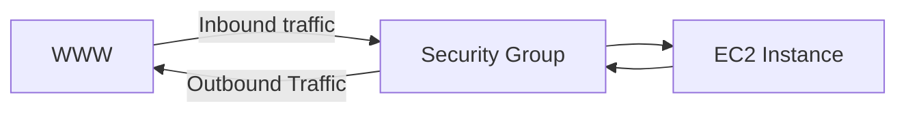
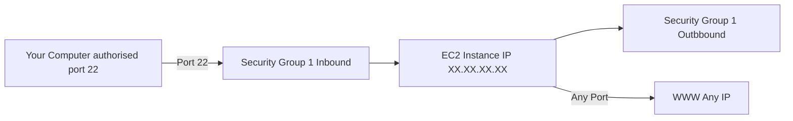

# AMAZON CLOUD SOLUTION ARCHITECT ASSOCIATE	


## Prerequisites

Create an Amazon account

- Aws enables you to build sophisticated, scalable applications  
- Applicable to diverse set of industries  
- Use cases include
    - Enterprise IT, Backup & Storage, Big Data analitycs  
    - Website hosting, Mobile & Social App  
    - Gaming


## AWS Cloud Overview - Regions & AZ

### AWS Global Infrastructure
- AWS Regions  
- AWS Availability Zones
- AWS Data Centers  
- AWS Edge Locations / Points of Presence  

[AWS infrastructure](https://aws.amazon.com/fr/about-aws/global-infrastructure/regions_az/)

### AWS Regions

- AWS has **Regions** all around the world  
- Names can be us-east-1, eu-west-3...
- A region is a **cluster of data centers**  
- **Most AWS services are region-scoped**

### How to choose an AWS Region ?

- **Compliance** with data governance and legal requirements:</br>data never leaves a region without your explicit permission</br>
- **Proximity** to customers: reduced latency</br>
- **Available services** within a Region:</br>new services and new features aren't available in every Region
- **Pricing**: princing varies region to region and is transparent in</br>
the service pricing page</br>

### AWS Availability Zoes

- Each region has many availability zones (usually 3, min is 3, max is 6).</br>
Example:
    - ap-southeast-2a
    - ap-southeast-2b
    - ap-southeast-2c
- Each availability zone (AZ) is one or more
discrete data centers with</br>
redundant power, networking, and connectivity</br>
- They're separate from each other, so that they're isolated from disasters</br>
- They're connected with high bandwidth ultra-low latency networking</br>

### AWS Points of Presence (Edge Locations)

- Amazon had 400+ Points of Presence (400+ Edge Locations & 10+</br>
Regional Caches) in 90+ cities across 40+ countries</br>
- Content is delivered to end users with the lower latency possible

https://aws.amazon.com/cloudfront/features

### Tour of AWS Console

- **AWS has Global Services:**
    - Identity and Access Management (IAM)
    - Route 53 (DNS Service)
    - CloudFront (Content Delivery Network)
    - WAF (Web Application Firewall)

- **Most AWS services are Region-scoped:**
  - Amazon EC2 (Infrastructure as a Service)
  - Elastic Beanstalk (Platform as a Service)
  - Lambda (Function as a Service)
  - Rekognition (Software as a Service)

- **Region Table:** https://aws.amazon.com/fr/about-aws/global-infrastructure/regional-product-services/?p=ngi&loc=4

## Console Home

Services > 

## IAM Introduction: Users, Groups, Policies

### IAM: Users & Groups

- IAM = Identity and Access Management, Global service
- **Root account** created by default, shouldn't be used or shared  
- **Users** are people within your organisation, and can be grouped
- **Groups** only contain users, not other groups
- Users don't have to belong to a group, but a user can belong to multiple</br>
groups

### IAM: Permissions
- **Users or Groups** can be assigned JSON documents called policies
- These policies define the **permissions** of the users
- In AWS you apply the **least privilege principle:** don't give more</br>
permissions than a user needs

```json
{
    "Version": "2012-10-17",
    "Statement": [
        {
          "Effect": "Allow",
          "Action": "ec2:Describe*",
          "Resource": "*"
        },
        {
          "Effect": "Allow",
          "Action": "elasticloadbalancing:Describe*",
          "Resource": "*"
        }
    ],
    "Resource": "*"
}
```

## IAM: Users & Groups Hands On

On searchbar, search for IAM then clock on Dashboard > </br>
On the left, click on Users


## IAM Policies

### IAM Policies Inheritance


### IAM Policies Structure 

- Consist of 
  - Version: oplicy language version, always include "2012-10-17"
  - Id: an identifier for the policy (optional)
  - Statement: one or more individual statements (required)

- Statements consist of 
  - Sid: an identifier for the statement (optional)
  - Effect: wether the statement allows or denies access (Allow, Deny)
  - Principal: account/user/role to wich this policy applied to
  - Action: list of actions this policy allows or denies
  - Resource: list of resources to wich the actions applied to
  - Condition: conditions for when this policy is in effect (optional)

```json
{
    "Version": "2012-10-17",
    "Id": "S3-Account-Permissions",
    "Statement": [
        {
            "Sid": "1",
            "Effect": "Allow",
            "Principal": {
                "AWS": ["arn:aws:iam:123456789012:root]
            },
            "Action": [
              "s3:GetObject",
              "s3:PutObject"
            ],
            "Resource": ["arn:aws:s3:::mybucket*"]
        }
    ]
}
```

## IAM MFA Overview

### IAM - Password Policy

- Strong passwords = higher security for your account
- In AWS, you can setup a password policy:
  - Set a minimum password lenght
  - Require specific characters types:
    - including uppercase letters
    - lowercase letters
    - numbers
    - non-alphanumeric characters
  - Allow all IAM users to change their own passwords
  - Require users to change their password after some time</br>
  (password expiration)
  - Prevent password re-use

### Multi Factor Authentication - MFA

- Users have access to your account and can possibly change configurations</br>
or delete resources in your AWS account
- **You want to protect your Root Accounts and IAM users**
- MFA = password you know + security device you own
- **Main benefit of MFA:**</br> 
If a password is stolen or hacked, the account is not compromised

### MFA devices options in AWS

**Virtual MFA device**
- Google Authenticator (phone only)
- Authy (phone only)

Support for multiple tokens on a single device.

**Universal 2nd Factor (U2F) Security Key**
- YubiKey (3rd party)

**Hardware Key Fob MFA Device**
- Gemalto (3rd party)

**Hardware Key Fob MFA Device for AWS GovCloud (US)**
- SurePassID (3rd party)

## IAM MFA Hands On

Click on Account settings > Password policy

## AWS Access Keys, CLI and SDK

### How can users access AWS ?

- To access AWS, you have three options:
  - AWS Management Console (protected by password + MFA)
  - AWS Command Line Interface (CLI): protected by access keys
  - AWS Software Developer Kit (SDK) - for code: protected by access</br>keys
- Access Keys are generated through the AWS Console
- Users manage their own access keys
- Access Keys are secret, just like a password. Don't share them 
- Access Key ID ~= username
- Secret Acces Key ~= password

### What's the AWS CLI ?

- A tool that enables you to interact with AWS services using commands in</br>your command-line shell
- Direct access to the public APIs of AWS services
- You can develop scripts to manage your resources
- It's open-source https://github.com/aws/aws-cli
- Alternative to using AWS Management Console 

### What's the AWS SDK ?

- AWS Software Development Kit (AWS SDK)
- Language-specific APIs (set of libraries)
- Enable you to access and manage AWS services programmatically
- Embedded within your application
- Supports
  - SDKs (JavaScript, Python, PHP,.NET, Ruby, Java, Go, Node.js, C++)
  - Mobile SDKs (Android, iOS, ...)
  - IoT Device SDKs (Embedded C, Arduino, ...)
- Example: AWS CLI is built on AWS SDK for Python

## AWS CLI Setup on Windows

Use the MSI Installer

Check if the installation work on the terminal
> aws --version

Enter your Key ID, Secret Access key</br>
Chose your region name (Exemple: eu-west-1)
> aws configure

List all users in the account
> aws iam list-users

## IAM Roles for AWS Services

### IAM Roles for Services

- Some AWS service will need to perform actions on your behalf
- To do so, we wil assign permissions to AWS services with IAM Roles
- Common roles:
  - EC2 instance Roles
  - Lambda Function Roles

## IAM Security Tools

- IAM Credentials Report (account-level)
  - a report that list all your account's users and the status of their</br> various credentials
- IAM Access Advisor (user-level)
  - Access advisor shows the service permissions granted to a user and</br> when those services where last accessed 
  - you can use thes informations to revise your policy tools

  ## IAM Guidelines & Best Practices

  - Don't use the root account except for AWS account setup
  - One physical user = One AWS user
  - Assign users to groups and assign permissions to groups
  - Create a strong password policy
  - Use and enforce the use of Mutifactor Authentication (MFA)
  - Create and use Roles for giving permissions to AWS services
  - Use Access Keys for Programmatic Access (CLI/ SDK)
  - Audit permissions of your account using IAM Credentials Report &</br> IAM Access Advisor
  - Never share IAM users & Access Keys

## AWS Budget Setup

**First you need to activate IAM access for users**

Click on top right (root account) ></br>Account >  IAM user and role access to Billing information > Edit > IAM Access


**Find the current usage**

Click on top right (account) > Billing and Cost Management > Bills (left) ></br> Charges by service (bottom)

**My zero spent budget**

Budget (left) > 
- Budget Name: insert a name 
- Enter budget amount:
- Email recipient : my email to be notified when I pass the budget
- Create

## EC2 Basics

### Amazon EC2

- EC2 is one of the most popular of AWS offering
- EC2 = Elastic Compute Cloud = Infrastructure as a Service
- It mainly consists in the capability of:
  - Renting virtul machines (EC2)
  - Storing data on virtual drives (EBS)
  - Distributing load across machines (ELB)
  - Scaling the services using an auto-scaling group (ASG)
- Knowing EC2 is fundamental to understand how the Cloud works

### EC2 sizing & configuration options

- Operating System (OS): Linux, Windows or Mac OS
- How much compute power & cores (CPU)
- How much random-access memory (RAM)
- How much storage space:
  - Network-attached (EBS & EFS)
  - hardware (EC2 instance Store)
- Network card: speed of the card, Public IP address
- Firewall rules: security group
- Bootstrap script (configure at first launch): EC2 User Data

### EC2 User Data

- it is possible to bootstrap our instances using an EC2 User data script
- boostrapping means launching commands when a machine starts
- That scipt is only run once at the instance first start
- EC2 user data is used to automate boot tasks such as:
  - Installing updates
  - Installing software
  - Downloading common files from the internet
  - Anything you can think of 
- The EC2 User Data Script runs with the root user

### EC2 instance types: example

instance | vCPU | Mem (GiB) | Storage | Network Performance | EBS Bandwith (Mbps)
| - | - | - | - | - | - |
| t2.micro | 1 | 1 | EBS-Only | Low to Moderate | |
| t2.xlarge | 4 | 16 | EBS-Only | Moderate | |
| c5d.4xlarge | 16 | 32 | 1 x 400 NVMe SSD | Up to 10 Gbps | 4,750 |
| m5.8xlarge | 32 | 128 | EBS-Only | 10 Gbps | 6,800 |

## Create an EC2 Instance with EC2 User Data 

## EC2 Instance Types - Overview 

- You can use different types of EC2 instances that are optimised for</br> different use cases (https://aws.amazon.com/ec2/instance-types/)
- AWS has the following naming convention:

**m5.2xlarge**

- **m**: instance class
- **5**: generation (AWS imporves them over time)
- **2xlarge**: size within the instance class

### EC2 Instance Types - General Purpose

- Great for a diversity of workloads such as web servers or code repositories
- Balance between:
  - Compute
  - Memory
  - Networking 

### EC2 Instance Types - Compute Optimized

- Great for compute-intensive tasks that require high performance</br> processors: 
  - Batch processing workloads
  - Media Transcoding
  - High performance web servers
  - High performance computing (HPC)
  - Scientific modeling & machine learning
  - Dedicating gaming servers

**Compute Optimized**</br>
The C (Compute) series</br>
| C6g | C6gn | C5 | C5a | C5n | C4

### EC2 Instance Types - Memory Optimized

- Fast performance for workloads that process large data sets in memory
- Use cases:
  - High performance, relational/non-relational databases
  - Distributed web scale cache stores
  - In-memory databases optimized for BI (business intelligence)
  - Applications performing real-time processing of big unstructured</br> data

**Memory Optimized**</br>
The R (RAM) series</br>
R6g | R5 | R5a | R5b | R4 | X1e | X1 | High Memory | Z1d

### EC2 Instance Types - Storage Optimized

- Great for storage-intensive tasks that require high, sequential read and</br> write access to large data sets on local storage
- Use cases:
  - High frequency online transaction processing (OLTP) systems
  - Relational & NoSQL databases
  - Cache for in-memory databases (Redis)
  - Data warehousing applications
  - Distributed file systems

**Storage Optimized**</br>
The I or D series</br>
I3 | I3en | D2 | D3 | D3en | H1


## Security Groups & Classic Ports Overview

### Introduction to Security Groups

- Security Groups are the fundamental of network security in AWS
- They control how traffic is allowed into or out of our EC2 instances



- Security groups only contain **allow** rules
- Security groups rules can reference by IP or by security group

### Security Groups Deeper Dive

- Security groups are acting as a "firewall" on EC2 instances
- They regulate:
  - Acces to Ports
  - Authorised IP ranges - IPv4 and IPv6
  - Control of inbound network (from the outside to the instance)
  - Control of outbound network (from the instance to other)

| Type | Protocol | Port Range | Source | Description|
| - | - | - | - | - |
| HTTP | TCP | 80 | 0.0.0.0/0 | test http page |
| SSH | TCP | 22 | 122.149.196.85/32 | |
| Custom TCP Rule | TCP | 4567 | 0.0.0.0/0 | java app |

### Security Groups Diagram



### Security Groups Good to Know

- Can be attached to multiple instances
- Locked down to a region / VPC combination</br> (if you change your region or your VPC, you have to recreate the Security</br> group)
- Does live "outside" the EC2  - if traffic is blocked the EC2 instance won't</br> see it
- It's good to maintain one separate security group for SSH access
- If your application is not accessible (time out), then it's a security group</br> issue
- If your application gives a "connection refused" error, then it's an</br> application error or it's not launched
- All inbound traffic is blocked by default
- All outbound traffic is authorised by default

### Classic Ports to Know

- 22 = SSH (Secure Shell) - log into a Linux Instance

- 21 = FTP (File Transfer Protocol) - upload files into a file share
- 22 = SFTP (Secure File Transfer Protocol) - upload files using SSH
- 80 = HTTP - access unsecured websites
- 443 = HTTPS - access secured websites
- 3389 = RDP (Remote Desktop Protocol) - log into a Windows instance
